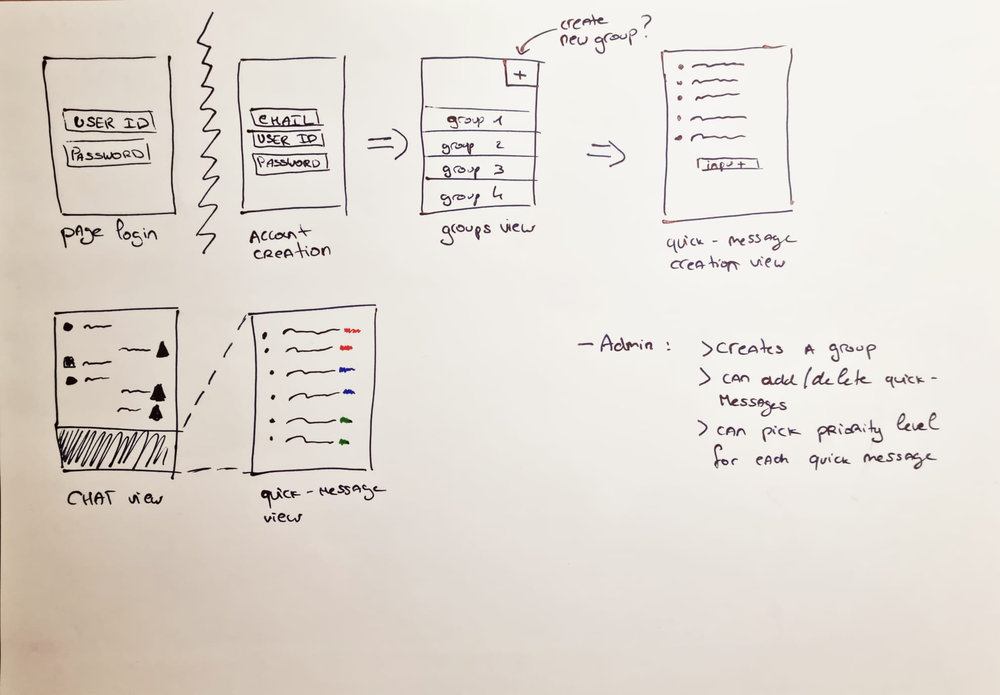

# Projet Groupe 2 - Messagerie instantanée avec messages prédéfinis

# Contexte
Ce projet est développé dans le cadre du cours "Programmation pour Internet II" (printemps 2022) dispensé par Loïc Cattani (Université de Lausanne).

# Liste des collaborateurs du projet
- Sophie 
- Vache
- Antonin 
- Tessa

# Description et principe
Ce projet consiste en une messagerie qui a pour but principaux d'être facile à utiliser, rapide, jolie et polyvalente.
Les utilisateurs doivent se créer un compte en fournissant leur adresse email, un nom d'utilisateur et un mot de passe. Une fois ceci fait, ils peuvent accéder à l'application et commencer à l'utiliser.

L'interface se veut simple et demandant le moins de clics possible dans le but d'être réactive. L'écran de démarrage permet de rapidement se créer un compte ou se connecter avec un compte existant. Une fois ceci fait, l'utilisateur peut librement cliquer sur les groupes auquels il appartient pour voir les derniers messages échangés, ou alors créer un nouveau groupe et inviter d'autres personnes (en entrant leur identifiant ou leur adresse email).

Pour envoyer un message, il suffit de le choisir dans la liste des messages par défaut et cliquer dessus. Il n'y a pas besoin de saisir de texte via un clavier. Le choix du message à envoyer se fait parmi une liste par défaut où les messages sont ordonnés par priorité (rouge étant une priorité "maximale", orange "moyenne" et vert "basse"). Le créateur d'un groupe peut aussi définir, lors de sa création et en plus des messages par défaut, des messages personnalisés et indiquer leur priorité.

Lorsqu'un message avec une priorité maximale est envoyé, une notification est envoyée sur la page d'accueil pour informer tous les utilisateurs rapidement.

# Fonctionnalités (général)
- Interface simple et minimale, ce qui permet une utilisation rapide
- Ne nécessite pas l'utilisation de clavier, car les messages sont sélectionnés dans une liste déroulante
- Différents types de messages par défaut classés par ordre "d'urgence"
- Utilisation de codes de couleurs pour définir la priorité des messages
- Possibilité de créer des groupes et y ajouter des messages personnalisés
- etc.

# Fonctionnalités planifiées/implémentées (dans le détail)
- Phase création de compte
- Phase log in
- Phase de création de groupes
- Phase de choix de messages instantanés au moment de la création d'un groupe
- Possibilité de changer et personaliser la liste de quick-messages
- Choix de la priorité des messages au moment de conception
- Possibilité de changer la priorité au moment de l'envoi, si nécessaire
- Phase de messagerie instantanée 
- Naviguation entre les groupes
- Notification des messages
- Base de données (compte, liste de quick-messages, groupes)
- Logique intuitive et simple à prendre en main

# Concept UI/UX, wireframe
Prototype de l'application avant le début du développement

- Un système intuitif et familier

# Interface
## Sign up et Login
 
- Si l'utilisateur n'est pas connecté, il peut soit cliquer sur le lien "Sign Up" situé sous le bouton "Login" pour s'inscrire, soit se logger. Sinon, s'il est déjà connecté, il sera automatiquement redirigé sur la page présentant les groupes auxquels il appartient.

- Sur la _home page_, l'utilisateur pourra accéder aux groupes dont il fait partie. L'utilisateur peut se déconnecter en cliquant sur le message de bienvenue qui se trouve dans le coin supérieur gauche. A droite, le + permet de créer un nouveau groupe (dont l'utilisateur actuel est l'admin) et qui sera nommé "Group name".

- La page du groupe est le cœur de l'application. Une fois dans le groupe. Seul l'admin pourra changer le nom du gruope en écrivant directement sur "Group Name". Le bouton _Settings_ permet à l'admin d'accéder directement à la page des paramètres du groupe. 

- Finalement, lorsque l'on clique sur le bouton _Send message_, une fenêtre pop-up apparaît au milieu de la page et permet aux utilisateurs d'envoyer des messages dans le groupe. À l'intérieur de la fenêtre pop-up, les messages seront affichés en trois couleurs. La priorité du message est définie en cliquant sur la couleur correspondante. Le message est envoyé une fois le clic est effectué. Pour quitter la pop-up, l'utilisateur doit cliquer en dehors de l'espace div. 

- La page des _Settings_, uniquement accessible par l'administrateur du groupe, offre la possibilité de modifier quelques fonctionnalités. Tout d'abord, il y a le type de groupe, qui définit une série de messages prédéfinis qui apparaîtront directement dans le pop-up à l'intérieur de la page du groupe. Il y a quatre types de groupes différents : _work_, _traval_, _friends_ et _other_. Des messages prédéfinis, variables selon le thème choisi, sont disponibles pour les trois premiers types, tandis qu'aucun message prédéfini n'est proposé si le type "other" est choisi. Cette fonctionnalité permet à l'administrateur de construire un groupe avec des messages prédéfinis sans avoir à se soucier des messages par défaut. Il faut noter qu'il est possible de modifier à tout moment le type de groupe, sans affecter les messages personnalisés. En outre, l'admin peut ajouter des membres par nom d'utilisateur et gérer les messages prédéfinis pour les rendre disponibles dans la fenêtre pop-up. 

# Analyse concurentielle, état de l'art
Il existe de nombreuses applications de messagerie avec des fonctionnalités beaucoup plus avancées que celle que nous proposons. Whatsapp, Telegram, WeChat, Signal, etc. permettent de partager avec des groupes prédéfinis non seulement des messages, mais aussi des images, des vidéos ou des audios. Certaines applications sont également étroitement liées à des plateformes d'emails, comme Hangouts ou Teams. En général, il ne semble pas y avoir d'applications de messagerie qui reposent sur des messages préenregistrés. L’intérêt principal de notre app est de permette une communication rapide en un nombre limité des clicks. 

En ce qui concerne la hiérarchisation des messages, de nombreuses applications offrent la possibilité d'organiser les éléments selon un schéma de couleurs, il s’agit surtout des applications de listes de tâches qui offrent souvent la possibilité de partager les listes avec des groupes ou des individus.

Fonctionnalités déjà utilisées par d'autres apps : création d'un compte, création de groupes avec un administrateur, priorité des messages par couleur. 
Innovations/Différences : système de messages préenregistrés.

# Analyse de faisabilité
Faisable

# Technologies utilisées
HTML, CSS, JS, Meteor Blaze, Visual Studio Code

# Gestion du projet
Le projet était codé ensemble en utilisant liveshare dépuis un seul ordinateur pour éviter les conflits lors du codage. Les individus du groupe ont tous participé à la création des pages du HTML, au CSS, au JS. 

# Description du MVP
Tous sauf le système des priorités/notifications. 

